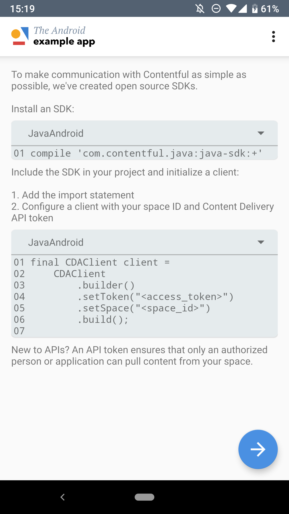

[](https://app.bitrise.io/app/e28f5db64f9dcc90)

## The Kotlin example app

This Kotlin example app teaches the very basics of how to work with Contentful for Android:

- consume content from the Contentful Delivery and Preview APIs
- model content
- edit content through the Contentful web app

The app demonstrates how decoupling content from its presentation enables greater flexibility and facilitates shipping higher quality software more quickly.



Installing the app can be done through this link: <a href="https://play.google.com/store/apps/details?id=com.contentful.tea.kotlin" target="_blank">The Kotlin example app on the play store</a>.

## What is Contentful?

[Contentful](https://www.contentful.com) provides a content infrastructure for digital teams to power content in websites, apps, and devices. Unlike a CMS, Contentful was built to integrate with the modern software stack. It offers a central hub for structured content, powerful management and delivery APIs, and a customizable web app that enable developers and content creators to ship digital products faster.

## Requirements

* Android Studio
* Git
* Contentful CLI (only for write access)
* Android build tools v 28+
* An Android phone 7.0 and up

Without any changes, this app is connected to a Contentful space with read-only access. To experience the full end-to-end Contentful experience, you need to connect the app to a Contentful space with read _and_ write access. This enables you to see how content editing in the Contentful web app works and how content changes propagate to this app.

## Common setup

Clone the repo and install the dependencies.

```bash
git clone https://github.com/contentful/the-example-app.kotlin.git
```

Open Android Studio and create a new project from the just downloaded source.


## Steps for read-only access

Open `gradle.build` in Android Studio and run the app on an emulator or directly on a device.

## Steps for read and write access (recommended)

Step 1: Install the [Contentful CLI](https://www.npmjs.com/package/contentful-cli)

Step 2: Login to Contentful through the CLI. It will help you to create a [free account](https://www.contentful.com/sign-up/) if you don't have one already.

```
contentful login
```

Step 3: Create a new space

```
contentful space create --name 'My space for the example app'
```

Step 4: Seed the new space with the content model. Replace the `SPACE_ID` with the id returned from the create command executed in step 3

```
contentful space seed -s '<SPACE_ID>' -t the-example-app
```

Step 5: Head to the Contentful web app's API section and grab `SPACE_ID`, `DELIVERY_ACCESS_TOKEN`, `PREVIEW_ACCESS_TOKEN`.

Step 6: Open <a href="app/build.gradle">app/build.gradle</a> and inject your credentials so it looks like this

```
buildConfigField("String", "CONTENTFUL_DELIVERY_TOKEN", "\"DELIVERY_TOKEN\"")
buildConfigField("String", "CONTENTFUL_PREVIEW_TOKEN", "\"PREVIEW_TOKEN\"")
buildConfigField("String", "CONTENTFUL_SPACE_ID", "\"SPACE_ID\"")
```

Step 7: Open `the-example-app.kotlin` in Android Studio and run the app on an emulator or device and take a look around the app.

<b>Enjoy exploring the app and feel free to leave <a href="https://github.com/contentful/the-example-app.kotlin/issues/new">feedback</a>.</b>
